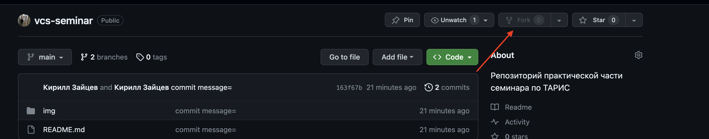
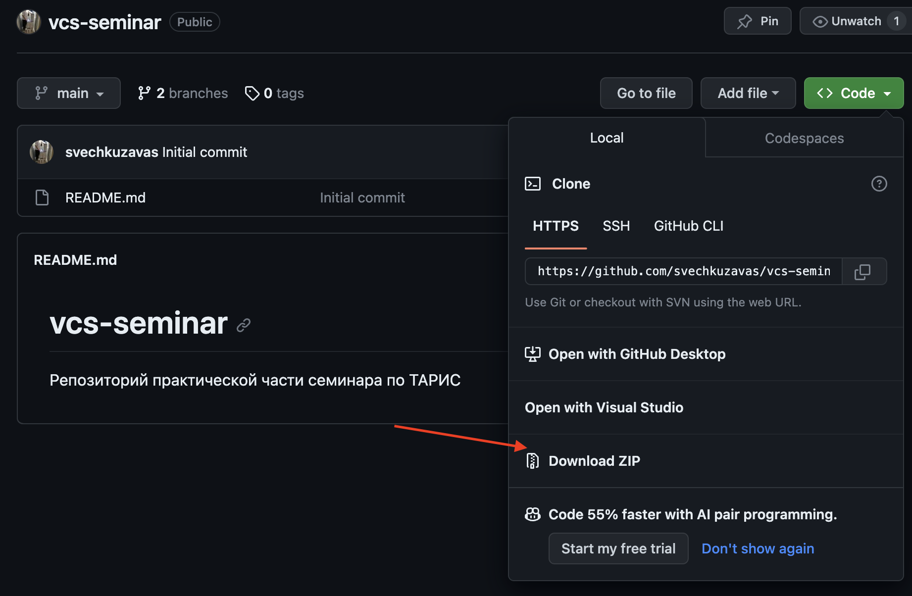
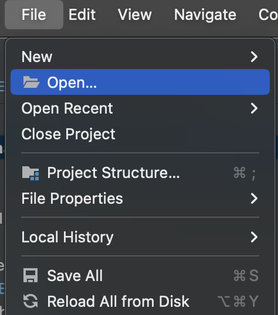
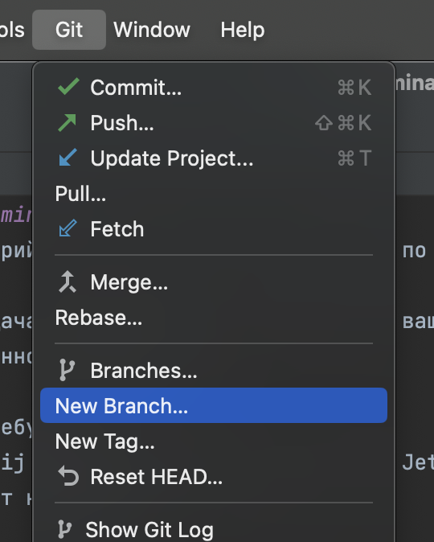

# vcs-seminar
Репозиторий практической части семинара по ТАРИС

Ваша задача: сделать так, чтобы папка с вашей фамилией оказалась в main 
ветке данного репозитория

Что потребуется: 
- Intellij Idea или любая другая IDE от JetBrains
- аккаунт на Github
1. Делаем форк данного репозитория:

2. Скачиваем архив форкнутого проекта:

3. Открываем его в IDE:

4. Репозиторий настроен так, что у вас не получится сделать push в
целевую ветку main. Вам необходимо создать собственную ветку, залить
ее на github и создать pull request к целевой ветке. Чтобы влить вашу
ветку в main необходимо получить аппрув от одного из представителей нашей группы.
Когда пул реквест будет создан, обращайтесь к нам.
5. Вернемся к проекту. Создайте свою ветку и перейдите на нее:

6. В своей ветке добавьте папку со своей фамилией и сделайте коммит

7. Сделайте пуш в удаленный репозиторий и проверьте, что ваша ветка
появилась на гитхабе

8. Создайте пул-реквест к основной ветке и зовите нас
